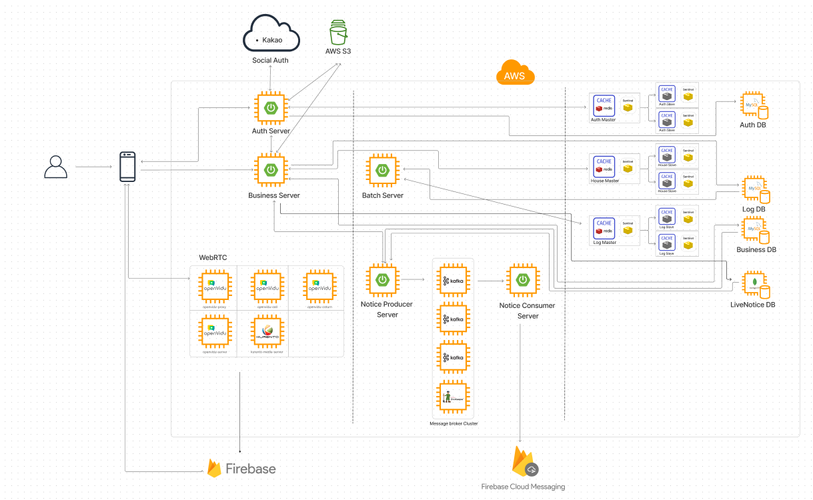

# 보여줘 왓슨
<div align="center">

</div>

### 개발기간  
2023.07.04 - 2023.08.18
### 주제
자취 등 집을 구할 때, 겪는 시,공간적  제약을 벗어나기 위해 부동산 업자가 직접 Live 방송을 통해 매물을 소개해줄 수 있는 부동산 모바일 앱

#### 사용 기술 스택

<div align="center">
<br>


</br>

<br>


</br>
<br>

</br>

<br>


</br>

<br>

</br>

<br>


</br>
<div>


</div>
</div>

### 발표자료
[ppt](docs/presentation/공통PJT_서울_8반_A803_허주혁.pdf)

</br>
https://youtu.be/E6jkImXQNa8


## 역할

### 프론트
##### 류정모
    - Figma 제작 
    - DM 
    - chatting 일반 유저 페이지 
    - 구글 맵을 통한 매물 정보 제공
    -  매물 관련 정보 필터
##### 허주혁
    - Figma 제작 
    - 로그인 페이지 (중개사, 일반 유저)
    - 매물 작성 페이지
    - 라이브 등록, 목록
    - 스케줄 등록, 목록

<br/>

### 백엔드
##### 김기헌
    - PM
    - 아키텍쳐, 시퀀스 설계
    - 배포 스크립트 작성
    - Redis 서버 구축
    - 로그 저장, 분석
    - 지역별 주간 랭킹 선정
    - 백엔드 깃 총 관리 
    - 코드 리팩토링
##### 박지영
    - Kafka와 FCM을 이용한 Notice 서버 개발
    - Openvidu 서버 구축
    - Redis 서버 구축
    - S3이미지 서버 구축
##### 오채영
    - 매물 CRUD 
    - 매물 필터링 
    - 관심매물 CRUD 
    - 방송 스케줄 게시판 CRUD
##### 이정민
    - 사용자/중개사 정보 CRUD
    - JWT 토큰을 이용한 로그인 및 인가
    - Spring Security

<br/>
<br/>
<br/>

## 협업 환경

### Git으로 협업하기

Git을 통한 협업 방식은 [우아한 형제들 Git Flow](https://techblog.woowahan.com/2553/)를 기본 베이스로 삼았습니다.

브랜치는 master, develop, dev-front, dev-back, feature 총 5가지를 사용했으며 전략은 다음과 같습니다.

- `master`: 서비스가 출시될 수 있는 브랜치입니다. master 브랜치에 올라온 기능들은 에러 없이 작동하는 상태입니다.
- `dev`: 다음 서비스 출시를 위해 실제 개발이 이루어지는 브랜치입니다.
- `frontend`, `backend`: develop 브랜치에서 분기해서 프론트엔드와 백엔드가 각각 개발하는 브랜치입니다. 프론트엔드와 백엔드 충돌을 최대한 방지하기 위해 만들어졌습니다.
- `feature`: 기능 단위 개발을 위한 브랜치로 dev-front, dev-back에서 분기하여 개발이 끝나면 각각 베이스 브랜치로 병합됩니다.


## MSA를 통한 분산 처리
    - Auth: 인증 및 인가 담당
    - Business: 매물 관련 서비스 담당
    - Notification Producer - Notification Consumer: Kafka로 통신, 관심 매물 Live 방송 공지 알림 + Live 방송 시작 알림 + DM 알림
    - ViewCalculator: 로그 관리 및 지역별 주간 랭킹 산정
- 고가용성(high availability)확보 위해 캐시 서버(Redis) Master - Slave 2개의 구조 + Sentinel

## 설계 및 UCC 등 정리 노션
https://www.notion.so/Watson-a38edbba5ca047629c04d70822f2b112?pvs=4

 
## 프로젝트 회고

나 또한 경험이 부족했지만 팀원들의 경우 프로젝트 경험이 모두 없었기에 설계 부분에서 많은 시간이 소요되었다. 
물론 완벽하게 설계 후 시작할 수는 없겠지만 그동안의 경험상 설계를 부실하게 했을 경우 구현 시 설계를 계속해서 바꾸어야 했고, 시간이 그만큼 더 소요 되었던 점을 인지하여 DB, 시퀀스, 아키텍쳐, API 등의 설계에 힘을 쏟았다.

특히 처음 경험하는 MSA 구조 설계였기 때문에, 설계 부분에서 무려 1주일이 넘는 시간이 소요되었다. 그동안 CRUD 위주의 프로젝트를 해왔기에, 설계만 제대로 되었다면 규모가 크더라도 구현은 금방 할 수 있다고 생각했다. 하지만 프로젝트 기간은 6주였고, 남은 3주의 시간 동안 개발, CI/CD, 배포, 프론트엔드와의 병합까지 해야 했다. 

그래도 개발만 빠르게 한다면 충분히 가능할 것이라고 생각했지만 3일 동안 CI/CD 설정을 시도했지만 실패했고, 결국 스크립트 파일로 반자동(?) CI/CD를 구축했다. 

또한 Redis나 Kafka, 그리고 FCM이나 Firebase Storage, Amazon S3, OpenVIDU 등 처음 사용해보는 것들을 구축하는데 뜻대로 되지 않아 생각보다 시간이 많이 소요되었고 그만큼 개발에 할애할 시간이 줄어들었다 .  결국 내 욕심에 나는 물론 팀원들과 마감 2주 전부터 주말에도 모여 프로젝트를 하고 9 to 6가 끝나고 집에서도 디스코드로 모여 프로젝트를 진행하는 사태가 발생했다. 

그럼에도 불구하고 시간이 부족하여 처음 생각했던 로드밸런싱이나 API Gateway같은 것들은 시도조차 해보지 못했다.

이는 PM이었던 내 잘못이 크다고 생각한다. 다음에 또 기회가 주어진다면 조금은 더 잘할 수 있지 않을까… 라는 자기 합리화를 하게 되었다.

물론 그만큼 많은 것들을 얻을 수 있었다. MSA구조를 설계, 개발하면서 Server to Server 통신이나, 모바일 앱이었던 만큼 데이터들을 MySQL, MongoDB, Redis, User Device Memory, User Device Cache에 각각 필요한 대로 분산하여 저장했고, Log를 활용한 지역 별 주간 랭킹 선정을 하면서 많은 고민을 했고, 그만큼 공부를 많이 할 수 있었다.

추가적으로 아쉬운 점이 있다면 2학기 되면서 프로젝트를 하며 코드리뷰를 적극적으로 하고 싶었지만,  프로젝트 기간이 6주였고, 마지막 1주는 테스트, 배포, 발표 준비, UCC 등에 시간을 쏟아야 했기 때문에, 기획, 설계를 제외하면 실질적 개발 시간이 약 3주밖에 되지 않았다. 누군가는 개발도 하고 코드 리뷰, 리팩토링도 잘 할 수 있는 시간이었겠지만 개발 경험이 많지 않았던 우리 팀에게는 개발하기에도 시간이 부족했다. 다음 프로젝트 때는 꼭..! 코드 리뷰를 통해 더 좋은 코드를 작성할 수 있도록 하자!


## 나의 개발
- Redis 서버 구축
    - 고가용성 확보를 위한 Master - Slave 2 구조와 sentinel
- 지역 별 주간 랭킹 산정
    - 하루 전 모든 로그 조회
    - 모든 매물에 대한 조회수(user - house 하루에 최대 1번) 계산
    
    ```java
    for (LogDto logDto : list) {
    		String dongleeName = logDto.getDongleeName();
    		Long houseId = logDto.getHouseId();
    		LocalDate logDate = logDto.getLogDate();
    
    		dailyViewCountMap.compute(houseId, (key, oldValue) ->
    			  oldValue == null
    				    ? new HashMapCustomValue(logDate, dongleeName, 1L)
                : new HashMapCustomValue(oldValue.getLogDate(), oldValue.getDongleeName(), oldValue.getViewCount() + 1)
        );
    }
    ```
    
    - houseId(매물 별) 조회수를 바탕으로 Redis에 저장 및 zSet을 통한 자동 정렬
        - `setName`: region + logDate (expireTime 8day)
        - `key`: {`houseId`}
        - `value`: `viewCount`
    
    ```java
    for (Map.Entry<Long, HashMapCustomValue> entry : dailyViewCountMap.entrySet()) {
    		Long houseId = entry.getKey();
        HashMapCustomValue tmp = entry.getValue();
    
        String dongleeName = tmp.getDongleeName();
        String logDate = tmp.getLogDate().toString();
        Long viewCount = tmp.getViewCount();
    
        String zSetName = "daily:viewCount:" + dongleeName + ":" + logDate;
        redisTemplate.opsForZSet().add(zSetName, houseId.toString(), viewCount);
        redisTemplate.expire(zSetName, 8, TimeUnit.DAYS);
    }
    ```
    
    - 지역별 주간 조회수 Top 5 선정
    
    ```java
    public List<String> getWeeklyRankByDongleeName(String dongleeName) {
            List<String> zSetKeys = new ArrayList<>();
            IntStream.rangeClosed(1, 7)
                    .mapToObj(i -> LocalDate.now().minusDays(i))
                    .map(date -> "daily:viewCount:" + dongleeName + ":" + date)
                    .forEach(zSetKeys::add);
    
            String tmpKey = "weekly:temp" + dongleeName;
    
            zSetOperations.unionAndStore(tmpKey, zSetKeys, tmpKey);
    
            List<String> top5List = new ArrayList<>();
            Set<Object> top5Set = zSetOperations.reverseRange(tmpKey, 0, 4);
    
            if (top5Set == null) return new ArrayList<>();
            top5Set.forEach(house -> top5List.add(house.toString()));
    
            return top5List;
        }
    ```
----
#### ER-Diagram 제작  


#### Architecture


#### 명세서
[기능명세서/API명세서](https://docs.google.com/spreadsheets/d/1O8tJik-yb2d7x9Nqm7bvH7MYdZcXFeiq4Sb5f2xZhYU/edit?usp=sharing)


## 정보구조도 


## Frontend
[figma](https://www.figma.com/file/SOoHTxgMwKQqBppPFFAvHY/%EB%B6%80%EB%8F%99%EC%82%B0-%EC%A4%91%EA%B0%9C-%ED%99%94%EC%83%81-%ED%94%8C%EB%9E%AB%ED%8F%BC-%EC%95%B1-MVP-(1%EC%B0%A8-%EC%99%84%EC%84%B1%EB%B3%B8)-(Copy)?type=design&node-id=111%3A2&mode=design&t=ZmTgbWDQAYHdGAx7-1)

##### 사용자
<div>


</div>

##### 중개자
<div>


</div>


-----


<!-- - MVP 제작
    - Figma MVP 제작
        - MVP (Flutter) 초안 미완성
            - filter
            - 매물 등록 페이지(agent)
            - Like
            - MyPage
            - user
            - agent
            - Live Page
            - Live Page map
            - direct distance
            - Map
            - Index
            - SignUp
            - social login
            - SignIn(우선적 회원가입 위주)
            - social login
            - Licenses
            - payment
            - Details
                - 전화, 메세지 연결하기
                - 구매 정보
                - 방 정보
                - 추가 옵션
            - Chatting
            - DM
            - 알림창
            - 공인중개사 사무소 페이지
            - 공인중개사 등록 매물 페이지
            - live 일정 공지 창
            - 게시판 형식?
            - splash -->


<!-- ## 개발 시작 및 진행 중 -->

<!-- ### Frontend


- Flutter MVP 제작
    - detail Page
        - 전화 연결
        - 구매정보
        - 방정보
        - 추가 옵션
        - carousel
    - filter
        - list
    - appbar
    - splash
    - navbar
    - router
    - 카카오 소셜 로그인(front)


### Backend

auth swagger(추후 외부 포트 닫을 예정)
http://i9a803.p.ssafy.io:8080/swagger-ui/index.html

business swagger
http://i9a803.p.ssafy.io:8081/swagger-ui/index.html

notice swagger
http://i9a803.p.ssafy.io:8082/swagger-ui/index.html


